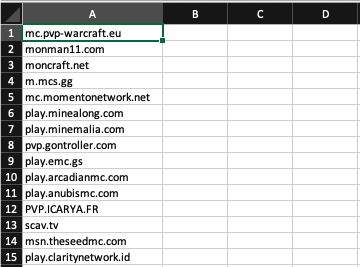

Production build of the Minecraft Server Audit.

This application uses an input of a .csv file with Minecraft server names in the first column and returns information from each server name.

\*\*maximum number of rows for input: 1048576

example input:

